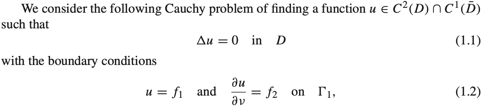
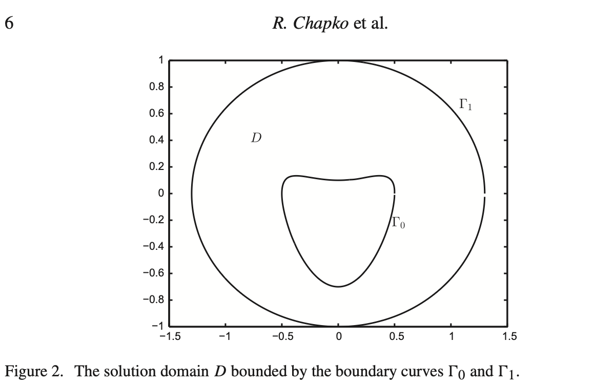
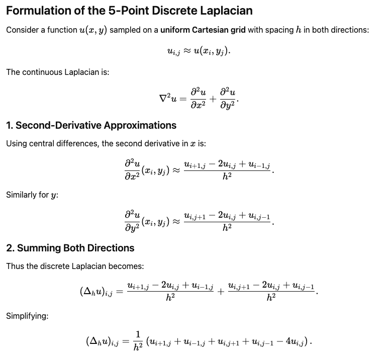

## Physics-informed diffusion model for solving ill-posed Cauchy problem for Laplace equation in bounded planar domain

### The problem statement



### The domain



### Physics Loss computation

Laplacian kernel



Laplacian kernel inside the domain is computed as a 2D convolution with 1-pixel padding.

#### Why padding=1 is needed

The padding=1 parameter is essential for the following reasons:

1. **Kernel Size**: The Laplacian kernel is 3×3. Without padding, a convolution with a 3×3 kernel on an input of size [B, 1, H, W] would produce an output of size [B, 1, H-2, W-2] due to the valid convolution operation.

2. **Preserve Spatial Dimensions**: With padding=1, the convolution adds a 1-pixel border around the input, making it [B, 1, H+2, W+2] temporarily. The 3×3 kernel then produces an output of size [B, 1, H, W], preserving the original spatial dimensions.

3. **Boundary Computation**: The Laplacian needs to be computed at every point in the grid, including points near the boundary. Without padding, you would lose 1 pixel on each edge, making it impossible to:
   - Compute the Laplacian at boundary points (needed for boundary condition losses)
   - Maintain correspondence between predicted_u and the conditioning maps (gmask, bmask, etc.) which are all size [B, 1, H, W]

4. **Edge Handling**: PyTorch's F.conv2d with padding=1 uses zero-padding by default, which provides a reasonable approximation for boundary pixels. While not perfect for physics (boundary conditions should be handled differently), it allows the convolution to operate on the full grid and the actual boundary physics are enforced through the boundary masks and loss terms later in the code.

In summary: padding=1 ensures the output has the same spatial dimensions as the input, allowing boundary point computation and maintaining tensor shape consistency throughout the physics loss calculation.

## Training

### Recommended Parameters

The following parameters are a starting point for physics-informed diffusion training on GPU hardware:

```bash
python model/physics_training_loop.py \
   --dataset harmonic_field_dataset_train.pt \
   --num_epochs 50 \
   --batch_size 32 \
   --learning_rate 0.0001 \
   --pixel_res 128 \
   --grid_size 3.0 \
   --num_diffusion_timesteps 1000 \
   --beta_start 0.0001 \
   --beta_end 0.02 \
   --laplacian_weight 1.0 \
   --boundary_weight 1.0 \
   --neumann_weight 1.0 \
   --output_dir ./checkpoints \
   --save_every 5 \
   --device auto

```

### Parameter Details

| Parameter          | Value | Purpose                                                    |
| ------------------ | ----- | ---------------------------------------------------------- |
| `num_epochs`       | 50    | Sufficient for physics constraint convergence              |
| `batch_size`       | 32    | GPU-optimized for gradient stability                       |
| `learning_rate`    | 1e-4  | Balanced rate for diffusion + physics learning             |
| `laplacian_weight` | 1.0   | Weight of the Laplace residual term                        |
| `boundary_weight`  | 1.0   | Weight of the combined boundary residual term              |
| `neumann_weight`   | 1.0   | Relative weight of Neumann residual vs. Dirichlet residual |

### Physics Loss Weighting (PIDM)

Following Bastek et al. 2024 ([arXiv:2403.14404](https://arxiv.org/abs/2403.14404), ICLR 2025), the physics residual is treated as a Gaussian observation with variance equal to the DDPM reverse-process posterior variance `Σ_t`, giving the **per-sample** weight `w(t) = 1 / (2 Σ_t)`:

```
L_total = L_simple + E_{t,x₀,ε}[ (1 / (2 Σ_t)) · ‖R(x̂₀(x_t, t))‖² ]
where Σ_t = (1 - ᾱ_{t-1}) / (1 - ᾱ_t) · β_t  and  Σ_0 := Σ_1
```

The residual `R` is a weighted sum of three components:

```
R = laplacian_weight · R_laplace + boundary_weight · (R_dirichlet + neumann_weight · R_neumann)
```

- The per-sample weight `w(t) = 1 / (2 Σ_t)` is the Gaussian-residual weighting from PIDM (Bastek et al. 2024, ICLR 2025): the residual is treated as a Gaussian observation with variance equal to the DDPM reverse-process posterior variance `Σ_t`. The convention `Σ_0 := Σ_1` mirrors the reference implementation (avoids `0/0` at `t=0`).
- High-noise timesteps (large `Σ_t`) automatically contribute less to the physics loss, because the recovered `x̂₀` is unreliable there; low-noise timesteps (small `Σ_t`) upweight it.
- There is no outer `physics_weight` scalar and no epoch curriculum — weighting is fully driven by `1/(2 Σ_t)` per sample.
- Physics is **disabled by default**: when `laplacian_weight`, `boundary_weight`, and `neumann_weight` are all `0.0`, the entire physics block (inversion + residual computation) is skipped.
- Per-batch mean of `w(t)` is logged each epoch as `mean_w_t` for diagnostics.

### Expected Performance

- **Training time**: ~2-3 hours on V100/A100 GPU
- **Convergence**: Laplace loss < 1e-4 by epoch 40-50
- **Boundary accuracy**: RMSE < 0.01 on boundary conditions
- **Model size**: 14.4M parameters (GPU memory efficient)

## Inference

### Ensemble Generation

For accurate physics solutions, generate multiple samples and use the ensemble mean:

```python
from model.generate_samples import load_trained_model, generate_samples

# Load trained model (defaults to the rolling best checkpoint kept by training)
model, scheduler = load_trained_model(
    checkpoint_path="./checkpoints/cond_ddpm_best",
    scheduler_config_path="./checkpoints/scheduler_best/scheduler_config.json",
    device=device
)

# Generate ensemble of 50 samples for accurate solution
num_samples = 50
cond = cond_single.repeat(num_samples, 1, 1, 1)  # Repeat conditioning
ensemble_samples = generate_samples(model, scheduler, cond, mu, sigma, num_steps=100)

# Ensemble mean = true Laplace equation solution
solution = torch.mean(ensemble_samples, dim=0, keepdim=True)
uncertainty = torch.std(ensemble_samples, dim=0, keepdim=True)
```

### Key Insight

The diffusion model learns `p(u|boundary_conditions)` where:

- **Ensemble mean** → True solution to Δu = 0
- **Ensemble std** → Model uncertainty/confidence map
- **Individual samples** → Valid solutions with noise
